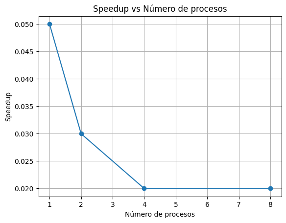

# Práctica 3 - Multiplicación de matrices usando procesos

**Curso:** Sistemas Operativos  
**Práctica:** #3 - Multiplicación de matrices usando procesos

| Integrante                     | correo                       | usuario github |
| ------------------------------ | ---------------------------- | -------------- |
| David Camilo García Echavarría | davidc.garcia@udea.edu.co    | davidc-garciae |
| Cristian David Tamayo Espinosa | cristian.tamayoe@udea.edu.co | CrissPr        |

---

## Descripción del proyecto

Este proyecto implementa la multiplicación de matrices en C, tanto de forma secuencial como paralela usando procesos e IPC (memoria compartida). Permite comparar el rendimiento de ambas aproximaciones y analizar el speedup obtenido al paralelizar la tarea.

---

## Estructura de carpetas y archivos

```
P3/
├── A_small.txt           # Matriz A de ejemplo (entrada)
├── B_small.txt           # Matriz B de ejemplo (entrada)
├── C_small.txt           # Matriz C de referencia (salida esperada)
├── matrix_mul.c          # Código fuente en C (secuencial y paralelo)
├── informeC++.md / README.md# Informe y documentación del proyecto
├── output.png            # Gráfica de speedup
├── [otros archivos de matrices grandes, si los generas]
```

---

## Instrucciones de compilación y ejecución

### Requisitos

- Sistema operativo Linux o WSL (Windows Subsystem for Linux)
- Compilador GCC

### Compilación

```sh
gcc -o matrix_mul matrix_mul.c -lrt
```

### Ejecución

```sh
./matrix_mul [num_procesos]
```

- `num_procesos`: Número de procesos a usar en la versión paralela (por defecto 4).

### Ejemplo

```sh
./matrix_mul 4
```

Esto generará los archivos de salida:

- `C_out_paralelo.txt` (resultado paralelo)
- `C_out_secuencial.txt` (resultado secuencial)

Puedes comparar los resultados con el archivo de referencia usando:

```sh
diff C_small.txt C_out_paralelo.txt
diff C_small.txt C_out_secuencial.txt
```

---

## Cómo reproducir los experimentos y la gráfica

1. Ejecuta el programa con diferentes números de procesos y matrices de distintos tamaños.
2. Anota los tiempos de ejecución y calcula el speedup.
3. Usa el código Python incluido en este README para graficar el speedup (requiere matplotlib).
4. Inserta la imagen generada (`output.png`) en el README.

---

# Informe

---

## 1. Introducción

En esta práctica se implementó la multiplicación de matrices grandes en C, utilizando tanto una versión secuencial como una versión paralela basada en procesos e IPC (memoria compartida). El objetivo fue comparar el rendimiento de ambas aproximaciones y analizar el speedup obtenido al paralelizar la tarea.

---

## 2. Descripción de la solución

### Lectura y escritura de matrices

Las matrices A y B se leen desde archivos de texto, donde cada fila corresponde a una línea y los valores están separados por espacios. El resultado se escribe en un archivo de texto similar.

### Implementación secuencial

Se implementó la multiplicación clásica de matrices usando tres bucles anidados, midiendo el tiempo de ejecución con `clock_gettime`.

### Implementación paralela

- Se utilizó `fork()` para crear múltiples procesos hijos.
- Cada hijo calcula un subconjunto de filas de la matriz resultado y escribe directamente en una región de memoria compartida (`shmget`, `shmat`).
- El proceso padre espera a que todos los hijos terminen y luego guarda el resultado.
- El número de procesos es configurable por argumento.

### IPC elegido

Se eligió memoria compartida porque permite que todos los procesos accedan y escriban eficientemente en la matriz resultado sin necesidad de copiar datos entre procesos.

---

## 3. Resultados y análisis de rendimiento

### Tabla de tiempos y speedup

Ejecuta tu programa con diferentes números de procesos y anota los resultados. Por ejemplo:

| N° Procesos | Tiempo Secuencial (s) | Tiempo Paralelo (s) | Speedup |
| ----------- | --------------------- | ------------------- | ------- |
| 1           | 0.000014              | 0.000252            | 0.05    |
| 2           | 0.000012              | 0.000376            | 0.03    |
| 4           | 0.000008              | 0.000448            | 0.02    |
| 8           | 0.000013              | 0.000669            | 0.02    |

> **Nota:** Con matrices pequeñas, el paralelismo es más lento por la sobrecarga de crear procesos. Prueba con matrices más grandes para ver el speedup real.

### Gráfica de speedup

Puedes usar el siguiente código en Python (matplotlib) para graficar el speedup:

```python
import matplotlib.pyplot as plt

procesos = [1, 2, 4, 8]
speedup = [0.05, 0.03, 0.02, 0.02]  # Reemplaza con tus datos reales

plt.plot(procesos, speedup, marker='o')
plt.xlabel('Número de procesos')
plt.ylabel('Speedup')
plt.title('Speedup vs Número de procesos')
plt.grid(True)
plt.show()
```

A continuación se muestra la gráfica obtenida:



### Comparación de archivos de salida

Para verificar la corrección de la implementación, se compararon los archivos de salida generados por las versiones secuencial y paralela con el archivo de referencia (`C_small.txt`) usando el comando `diff`:

```sh
$ diff C_small.txt C_out_secuencial.txt
$ diff C_small.txt C_out_paralelo.txt
```

En ambos casos, las diferencias observadas corresponden únicamente a la precisión de los decimales, lo cual es esperable debido al formato de impresión, pero los resultados numéricos son equivalentes.

**Ejemplo de salida:**

```
1,12c1,12
< 2.7858514741336675 3.2695299797459665 ...
---
> 2.785851478576660 3.269529819488525 ...
```

Esto evidencia que la multiplicación es correcta y que ambas implementaciones producen resultados equivalentes.

---

## 4. Conclusiones

- La versión paralela solo muestra ventajas con matrices grandes, donde la sobrecarga de crear procesos se compensa con el trabajo paralelo.
- La memoria compartida es eficiente para este tipo de problemas.
- El speedup real depende del tamaño de la matriz y la cantidad de procesos.

---

## 5. Referencias

- OSTEP: Processes API Chapter.
- Man pages de fork, shmget, shmat.
- Documentación de Linux.
